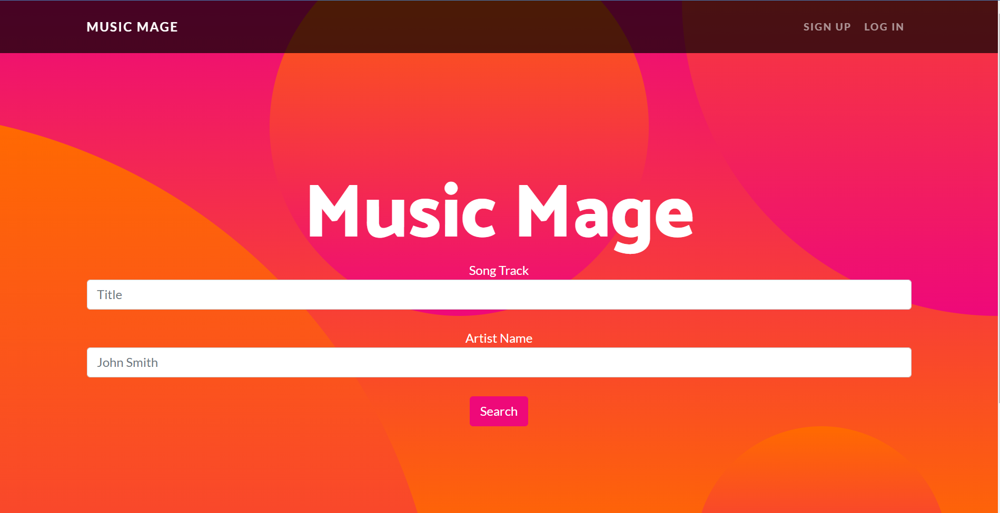

# Music Mage

## Project Description
The goal of this project was to integrate all of the skills learned in the UNC Data Analytics Bootcamp (May-Nov 2021). It involves the use of data analytics, Spotify's web API, web design, Django application development, and web server technology. The final product, when finished, will be live at https://www.music-mage.com.
